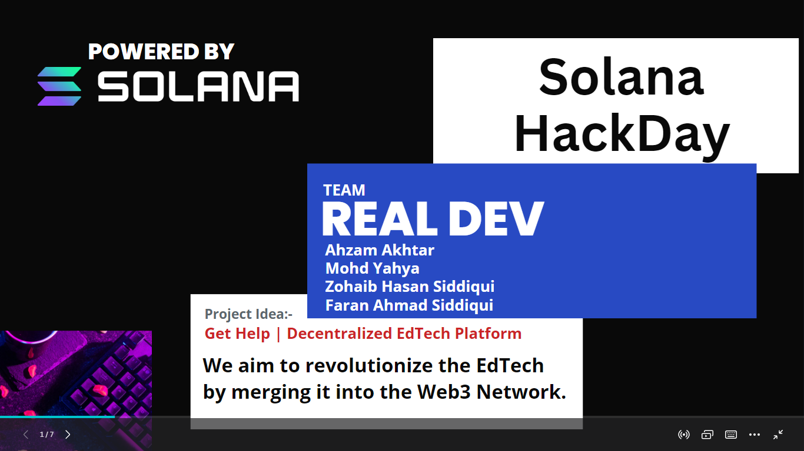
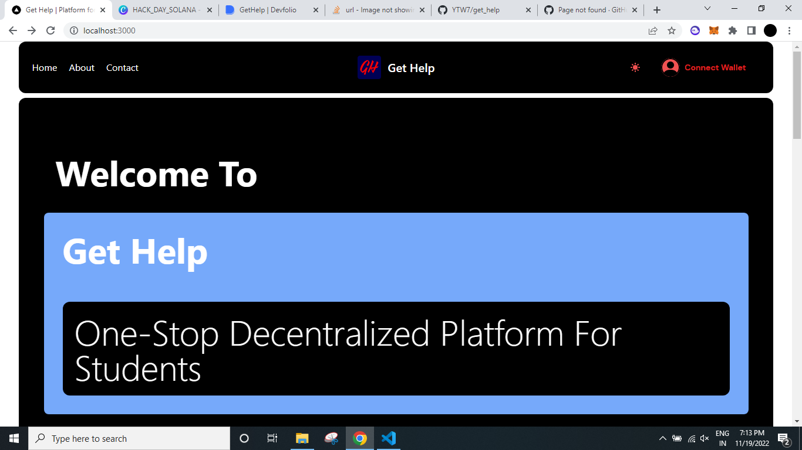
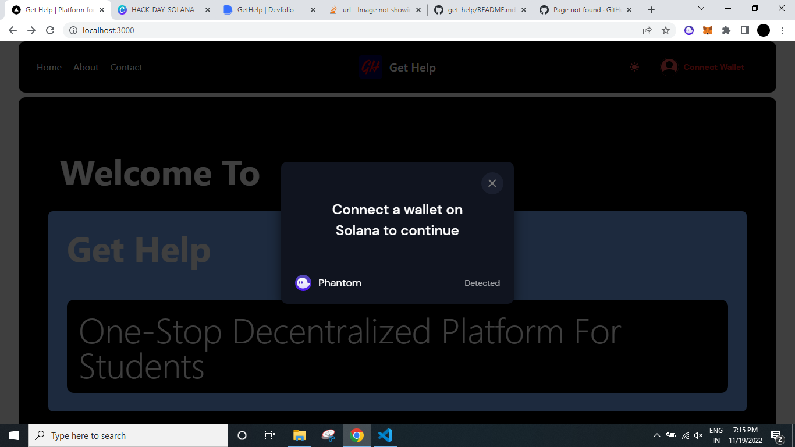
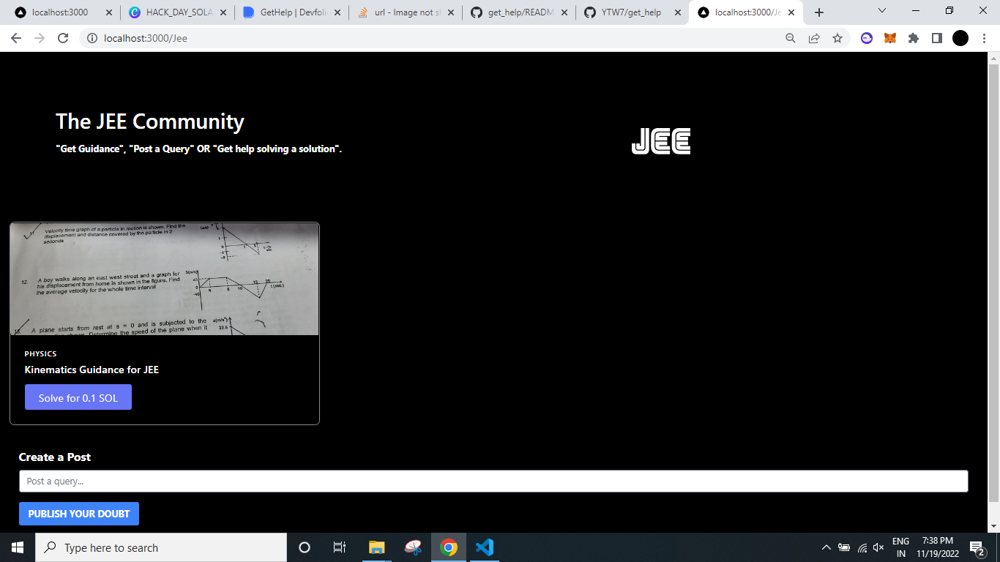

# Team Name: 
**HackCrew JH**
# Team Members: 
**Ahzam Akhtar, Mohd Yahya and Ali Khan**
# Problem Statement: 
**Cost effective, customized, faster and safer solution to competitive exam preparation.**
# Our Solution: 
**"GetHelp" A decentralized platform for competetive exam guidance and doubt solving. Our platform allows aspirants to join any competitive exam-community depending on the exam they are preparing for and post there doubts, queries and guidance resolutions for which they can pay as low as they want in crypto.
On the other hand, they can even solve other member’s doubts for earning crypto that the other member is willing to pay. Our project tries to compete with the huge Coaching Industry with our One-to-One community platform solution.**
# Tech Stack Used: 
**NextJS, Rust, Anchor Framework, TailwindCSS, Solana and Replit.**
# Github Repository Link:
**https://github.com/YTW7/get_help_v2**
# Video Link Explaining the Project and working: 
# Prize Tracks Covered: 
**Solana and Replit**

# Snippets of Our Project are given below:-

